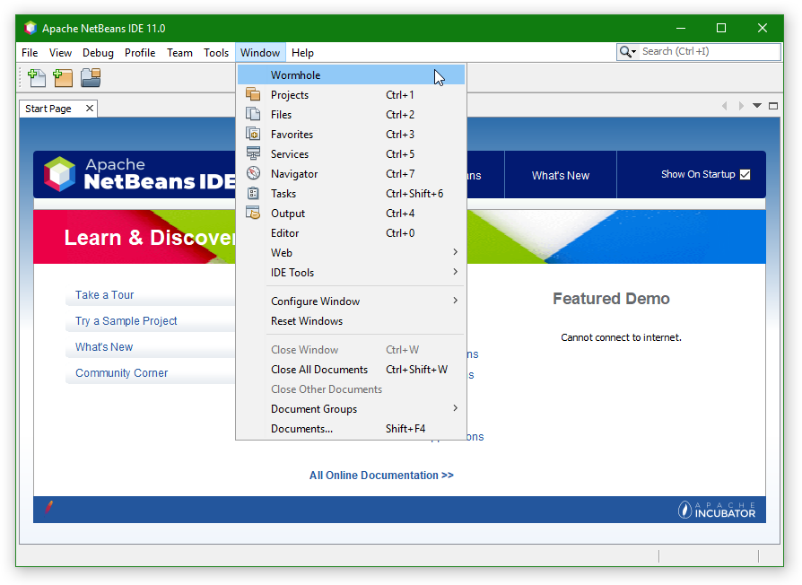
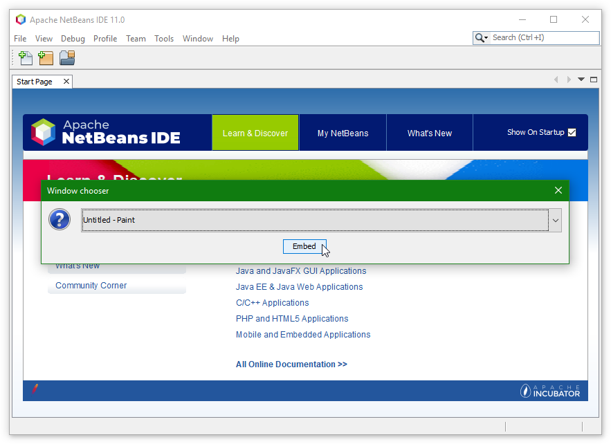
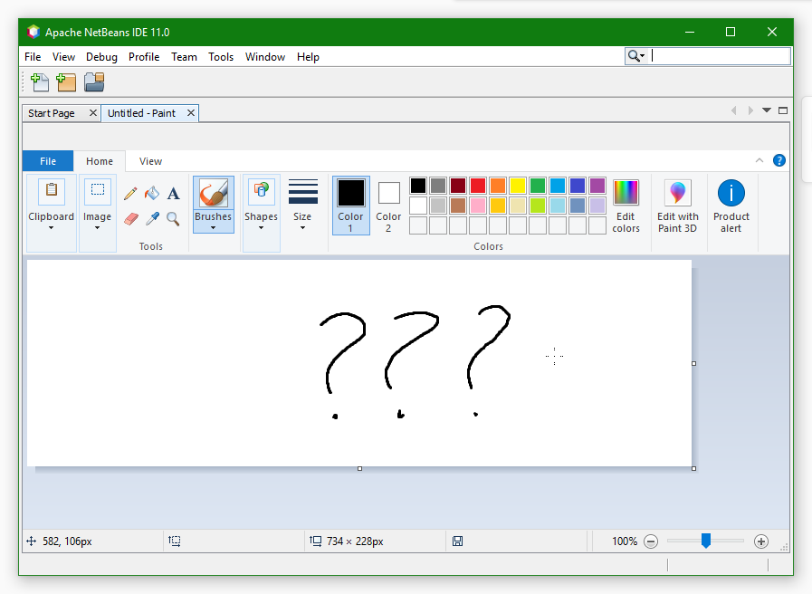
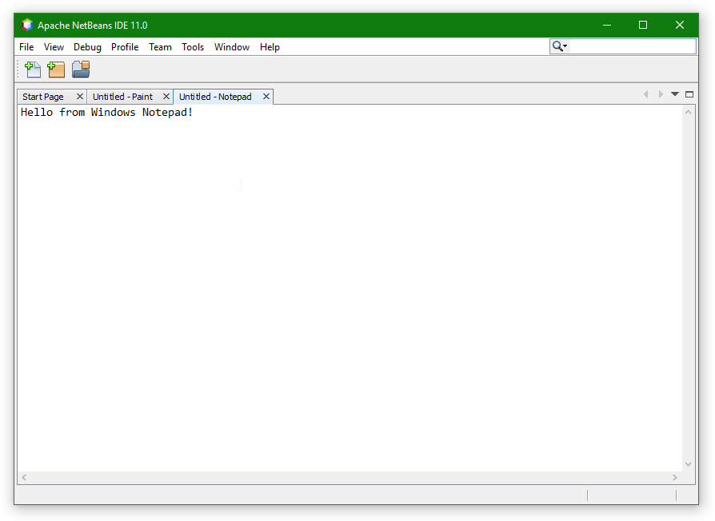

# NetBeans Wormhole
Embed (almost) any window inside NetBeans.

## Usage
Select `Window | Wormhole`, then choose a window you want to embed. The window will be moved into a new tab.

## What is supported?
The only OS supported now is Windows.

Embedding tested for apps:
* Text editors (MS Notepad, Notepad++).
* Image editors (MS Paint).
* Browsers (Firefox).
* Media players (PotPlayer).

UWP apps are unsupported.

## Screenshots
### Menu item

### Window chooser

### Embedded MS Paint

### Embedded MS Notepad

